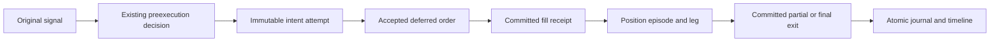

# NEXUS Strategy Intelligence — Sprint 1 implementation report

Sprint 0's audited architecture and file-by-file plan at
`/workspace/nexus-audit/NEXUS_STRATEGY_INTELLIGENCE_AUDIT.md` were the primary
reference. This change adds observation and a versioned calculation contract.
It does not enable live trading, deploy, change strategy/risk rules, change
leverage, create dashboards, select strategies, or change accounting writes.

## Files and interfaces

All paths below are relative to `automation-hub/`.

| Files | Result |
|---|---|
| `services/strategy_identity.py` | Full actual-object effective configuration, canonical JSON, SHA-256 configuration hash, separate source/dependency manifest, observed/declared version and mismatch status |
| `data/journal_evidence_migrations.py`, `data/journal_store.py` | Additive journal schema, immutable snapshots/events/episode links, exact retry checks, foreign keys, scoped episode projection and execution-event lookup |
| `data/decision_store.py` | Nullable strategy/configuration/source/owner/account/lab/session/mode/source-kind headers and real `decided_at`; conflicting reuse of an immutable decision identity is rejected without creating a second decision |
| `services/strategy_evidence.py` | Decimal receipt normalization and episode projection; explicit entries/remainder/exit links; no order API |
| `services/strategy_evidence_capture.py` | Frozen original signal/decision/intent contexts, scoped durable attempt IDs, exit preparation, actual fill/closure journal hooks, exact primary-receipt restart reconciliation and pending cancellation observations |
| `services/auto_engine.py` | Observe the actual strategy and preexecution decision; retain real decision time and existing decision ID; unavailable/conflicting capture cannot inherit a trusted previous cohort |
| `services/signal_pipeline.py` | Persist prefill context and accepted deferred intent; preserve original exit reason/MAE/MFE; evidence failures remain isolated |
| `execution/paper_engine.py` | Additive committed fill receipts and isolated pre-exit preparation hook; actual parent/remainder IDs, original entry risk, costs and fill time; deferred recovery observes existing committed opens |
| `data/ledger.py`, `services/trading_instances.py` | Read-only primary execution receipt lookup, instance/session scope, worker recovery and cancelled-pending evidence; financial SQL/RPC writes unchanged |
| `services/decision_journal.py` | Signal/decision/fill timestamps, immutable cohort/episode headers, atomic entry+timeline and exit+evolution+timeline transactions |
| `services/trade_memory.py`, `services/trade_memory_manager.py` | Explicit scoped decision references, legacy heuristic linkage marked unverified, accurate booked cost receipts, preserved human notes |
| `services/strategy_intelligence_metrics.py`, `services/strategy_intelligence_projection.py`, `scripts/recompute_strategy_intelligence.py` | Exact-cohort calculation v1 and deterministic SQLite read-only projection/reconciliation CLI |
| `strategies/adaptive_trend_pullback/strategy.py` | One defensive filter: omit empty optional series when reporting timeframe closes |
| `tests/test_adaptive_trend_pullback.py`, `tests/test_trading_instances.py` | HTF regressions and expected additive server-owned scope |
| `tests/test_strategy_identity.py`, `test_strategy_identity_runtime.py`, `test_strategy_evidence.py`, `test_strategy_evidence_runtime.py`, `test_paper_evidence_receipts.py`, `test_execution_receipt_lookup.py`, `test_decision_identity_evidence.py`, `test_journal_evidence_metadata.py`, `test_trade_memory_evidence.py`, `test_strategy_intelligence_metrics.py`, `test_strategy_intelligence_recompute.py` | New regression/integration tests |
| `docs/STRATEGY_INTELLIGENCE_METRICS_V1.md`, this report, `docs/XRP_ADAPTIVE_MTF_RECONCILIATION_SPRINT1.json` | Formula/migration contract, implementation findings and read-only XRP evidence report |

## Database migration and models

`apply_evidence_migrations()` runs from the existing JournalStore constructor.
It adds nullable headers to `trade_decision_journal`, nullable unique event IDs
to `trade_decision_events`, and four journal-local metadata tables:

- `strategy_evidence_versions`: immutable strategy/version/configuration snapshots.
- `strategy_evidence_events`: immutable scoped causal and committed execution receipts.
- `strategy_position_episodes`: immutable root position metadata.
- `strategy_episode_legs`: immutable exact parent/remainder/entry associations.

Updates/deletes of these evidence tables are denied by triggers. New hashed
journal headers require an existing matching snapshot and their identity fields
cannot be revised. Journal-local foreign keys are enabled. Cross-store IDs are
validated against read-only primary receipt lookups; there is no cross-database
foreign key. Episode economics/status are derived from immutable fill events,
not maintained in a second account ledger.

DecisionStore adds nullable provenance columns through its existing additive
migration mechanism. It does not assign current settings or timestamps to old
decisions. No Postgres migration, primary ledger migration, financial record
rewrite, historical deletion or configuration/secrets/deployment edit is added.

Compatibility migration tests open old schemas, apply the migration repeatedly
and verify preserved history and nullable unknown identity. Rollback stops the
new producers and runs the old application on this superset schema. Retain the
new tables/headers and financial history; dropping them is unnecessary and
would destroy evidence. Production backup/restore and upgrade review are still
required before an operator applies this release to production stores.

## Identity and evidence lineage

`adaptive_trend_pullback` and observed version `1.0.0` are retained. All Adaptive
dataclass settings, inherited effective parameters and resolved native timeframe
policy are captured from the instantiated strategy. Factories and environment
variables are not changed or re-read to fabricate a historical configuration.
Strict typed canonical JSON is hashed with SHA-256; map order does not affect
identity, effective parameter changes change the hash, and nonfinite/unsupported
or secret-bearing inputs cannot become trusted snapshots. The snapshot is
detached from mutable objects. Declared/observed version mismatch is explicit and remains unverified in the
v1 identity flag, while the actual observed-version cohort can still be inspected.

The captured path is:

Each retry attempt has a scoped content-addressed context while retaining the
existing execution key and original decision. An exact persistence retry is a
no-op. Rejected, expired and cancelled observations remain separate from fills.
An already-existing deferred order is recorded as such rather than represented
as a newly placed order. Signal, decision, intent, actual execution, trade,
position and episode IDs are retained. Cross-store decision references are validated against known scope before an
execution is credited. Conflicting or missing references retain their claimed
ID as unverified context and cannot fall back to another decision. No observer
creates decisions after execution or submits orders.

Queued/approved signals keep their original frozen configuration even after
the active worker configuration changes. Restored legacy limit signals without
a snapshot keep a NULL fingerprint. Decision references must have an accepted
verdict and matching normalized side as well as matching known scope; rejected
or opposite-side decisions cannot be credited to an executed fill.

Exit preparation is written before the existing accounting call, but it is
not execution evidence. Recovery requires its exact ID in committed primary
`paper_executions` and matching stored economics. OPEN recovery joins exact
trade/position IDs. REDUCE recovery uses the prepared parent plus the primary
receipt's actual child IDs. Unknown parent links are not inferred by symbol or
time. Entry and exit timeline/evolution writes commit atomically, and duplicate
or concurrent close delivery cannot increment evolution twice.

Capture failures are logged and do not gate an order or protective exit. A
cross-store outage/crash can still lose uncaptured quote/context facts. Ambiguous
attempts, absent preparations or source conflicts remain incomplete. Eliminating
that window would require a separately reviewed atomic accounting outbox; it is
not introduced as an execution/accounting change in this sprint.

## Completed-trade definition and financial basis

One completed statistical trade is one explicitly linked position episode from
its first entry to its final closure. Every partial exit closes a ledger leg;
its remainder stays in the same episode. Completed-trade counts exclude open
episodes, including their already-realised partial legs. Their evidence still
shows realised-leg totals. Position-level net/gross/cost totals sum constituent
exit receipts using Decimal, without charging fees twice. SQLite REAL precision
cannot be restored and remains disclosed.

Episode net R uses immutable actual initial monetary risk. Explicit scale-in
entry risk is added; a remainder leg adds no new risk. A reversal closes the
old episode and opens a separate episode when the existing execution path
actually opens another position. Existing same-direction holds and close-only
opposite signals are preserved; this change does not introduce scale-in orders
or change reversal timing. Trailed stops do not replace original episode risk.
Funding is currently not modeled by paper execution: its coverage is UNMODELED
and the analytical amount remains unknown rather than verified zero.

## Analytics isolation and compatibility

`strategy_intelligence.v1` requires strategy ID, observed version, configuration
hash, owner/account, instance/lab/session, execution mode and source kind.
Forward paper, historical backtest and replay/simulation use separate cohorts;
rejected/hypothetical/counterfactual/shadow source facts never enter realised
performance even if their row is incorrectly labelled executed. Legacy records
with missing identity remain unknown. Read-only recomputation has deterministic
watermarks and refuses truncated results. Journal-only data does not prove full
history, so `history_complete` remains false.

Existing dashboard formulas/endpoints are retained. The v1 contract documents
that legacy performance counts ledger rows, so partial exits can inflate its
count; its so-called gross totals can actually use booked net P&L; no-loss PF
can be 99; and legacy research aggregates can contain counterfactual net R.
Consumers must explicitly choose v1 and compare both formulas before migration.
Deferred journal/decision/memory completeness and truthful fee text improve new
records; this can increase available legacy journal samples without changing a
legacy formula. Legacy evolution remains a compatibility aggregate and must
not be used as the new isolated strategy-performance authority.

The existing `decision_timestamp` in the deferred engine is also its signal-time
quote eligibility boundary. Replacing it with wall-clock decision time would
change fills, so it is preserved. New evidence separately exposes true
`observed_decision_timestamp`, `signal_timestamp`, `fill_eligibility_timestamp`
and actual fill/journal timestamps. No earlier decision time is manufactured.
Delayed limit routing retains its original signal timestamp separately from
the unchanged fill eligibility timestamp. Risk-check/sizing timeline events use
the observed order preparation time, rather than backdating later gates to the
original strategy decision.

## Optional HTF correction

The crash came from indexing an empty optional series while collecting
`timeframe_closes` telemetry. The one-line correction skips empty series there.
Required context keeps the existing fail-closed policy. Optional missing/empty/
stale/valid context regressions and the existing valid signal digest pass.
Entry conditions, quality scoring, stop/target planning and SMC/Price Action
rules are unchanged.

## XRP reconciliation

Read-only inspection of `/workspace/nexus-dev-data` and checkout `logs` found
zero XRP Adaptive closed ledger rows and zero journal evidence for the claim.
These are development stores, not an authoritative production export.

| Claimed or required metric | Result |
|---|---|
| 22 trades | UNVERIFIED |
| 40.9% win rate | UNVERIFIED |
| PF 1.13, gross/net PF basis | UNVERIFIED |
| +$0.84 net P&L | UNVERIFIED |
| Gross P&L, fees, funding, episode count | UNVERIFIED |
| Historical version, fingerprint, execution mode, time period | UNVERIFIED |

The machine-readable reconciliation artifact retains NULL metric values and
explicit blockers. It does not infer a historical `1.0.0` from the current
implementation or fabricate trades to match the claim.

## Remaining risks, readiness and Sprint 2 prerequisites

Production deployment readiness is **not approved**. Nothing was deployed.
The five pre-existing authentication/UI test failures under generated landing/
dashboard assets must be addressed through the appropriate UI test contract,
and a production-shaped restored database migration/recovery dry run remains
necessary. The legacy route tests pass when built assets are absent, and their
failures reproduce on unchanged code with the same generated assets.

Other practical limits:

- An atomic cross-store outbox is absent; unknown lost context stays incomplete.
- Frozen source/dependency manifests include runtime versions. A conflicting
  source under the same version/configuration cannot overwrite the baseline;
  new capture is marked unavailable and excluded from its trusted old hash.
  A reviewed provenance/version policy is needed before such runtime upgrades.
- Existing remote trade/position readers can be provider-capped even though the
  new primary execution-receipt reader paginates. Remote production completeness
  and real Supabase round trips are not established by local fixture tests.
- Funding is unmodeled; historical config/episode gaps remain unresolved;
  journal-only projections cannot assert complete production history.
- Old dashboard/research/evolution aggregates retain their compatibility
  semantics and are not the isolated v1 metric authority.

Sprint 2 needs an authoritative production evidence export with explicit owner,
account, instance/lab/session, strategy/version/hash, source/mode and period;
reviewed migration/recovery validation; a source/runtime upgrade policy; cost
and funding coverage; and an explicit versioned API/consumer contract for v1.
Any stronger accounting/outbox change or live authority needs separate scope
and review. New intelligence dashboards and strategy selection remain outside
this sprint.

## Test evidence

The original Sprint 0 selection passed **97 tests** before implementation. The
same selection now passes **112 tests**, retaining the 97 and adding 15 HTF
regressions (`/tmp/nexus-sprint1-retained-baseline.log`). The root suite passed
**508**, with no failures/skips (`/tmp/nexus-sprint1-full-root.log`).

The eleven new regression/integration files pass **257 tests**, with no
failures/skips (`/tmp/nexus-sprint1-final-new-tests.log`). They cover complete
fingerprints, immutable snapshots, true deferred-fill journals, exact IDs,
retry attempts, restart/commit recovery, atomic journal failures/concurrency,
partial and scale-in/reversal reconciliation, precise costs/R, historical
compatibility, scoped decision references, source/version/mode isolation and
counterfactual exclusion. Queued/restored-limit configuration and clock preservation,
rejected/opposite-side reference rejection also have runtime regressions.
Focused live-engine/forward signal checks also passed
**40 tests** after adding signal facts and nonexecuting outcome observations
(`/tmp/nexus-sprint1-final-signal-outcomes.log`).

An unchanged tracked checkout passed **2272 Hub tests / 15 skipped** without
built UI assets (`/tmp/nexus-sprint1-baseline-full-hub.log`). The same unchanged
source with the existing generated `landing`/`webui` assets reproduced exactly
**5 failures / 47 passed** across the affected authentication/UI test files
(`/tmp/nexus-sprint1-baseline-assets-auth.log`). These failures are:

- `test_auth_accounts.py::test_react_dashboard_requires_login`
- `test_auth_endpoints.py::test_the_pending_ticket_is_not_usable_as_a_session_cookie`
- `test_hub_app.py::test_dashboard_requires_login`
- `test_hub_app.py::test_full_phase1_flow`
- `test_hub_app.py::test_overview_has_live_stream_client`

They exercise legacy-route/HTML expectations when a public landing owns `/`
and the compiled dashboard owns `/app`; this sprint changes neither frontend
nor authentication. The final full Hub suite passed **2539 tests**, with these
**5 pre-existing failures**, **15 existing skips**, and 83 warnings in 323.27s
(`/tmp/nexus-sprint1-verified-hub.log`). The 257 new tests and 112 retained-focus
tests are subsets of the Hub suite and must not be added to its total.

The 15 existing skips are intentional risk-parity cases: eight “not a validity
scenario,” seven “only comparable when both approve.” Compile checks and
`git diff --check` pass. A final AST comparison confirmed **all 78 pre-existing
ledger methods unchanged**, including the 24 accounting methods checked earlier
and SQLite/Supabase open/close/reduce write interfaces. Read-only receipt APIs
are the only ledger additions. A separate final review found no further
financial-write or fill-eligibility changes.

