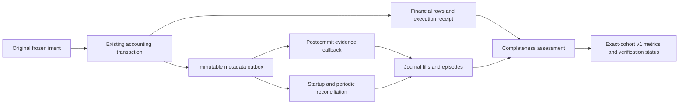

# NEXUS Strategy Intelligence — Sprint 1.5

Sprint 1.5 implements authoritative evidence recovery, explicit completeness
reports and production-shaped validation. No production connection or deployment
was performed. Strategy rules, risk limits, leverage, fill eligibility, account
math and existing dashboard formulas are preserved. Sprint 2 intelligence is
not implemented.

The reference is the completed Sprint 0 audit at
`/workspace/nexus-audit/NEXUS_STRATEGY_INTELLIGENCE_AUDIT.md` and the existing
[Sprint 1 report](STRATEGY_INTELLIGENCE_SPRINT1.md). Sprint 1 and Sprint 1.5 share
an uncommitted working tree; the file inventory below identifies Sprint 1.5
extensions rather than attributing the whole cumulative diff to this sprint.

## Focused gap assessment and recovery architecture

Financial authority is `positions`, `paper_trades` and committed
`paper_executions` in the existing ledger. The journal is a separate SQLite
store. Sprint 1's committed-ID lookup could recover an open but could lose
original context and partial-exit parents when the journal was unavailable
before preparation or after a financial commit. Delivery success alone did not
prove that every authoritative event had reached the journal. The original
five UI failures were stale test contracts for the bundled public/React routes.

SQLite accounting operations and PostgreSQL accounting RPCs have a suitable
transaction boundary. The smallest durable repair is an immutable metadata
outbox in that existing transaction, followed by idempotent journal replay.
There is no second paper account or financial replay operation.



| Failure scenario | Recovery and evidence boundary |
|---|---|
| Order executes, evidence callback fails | Financial rows, execution ID and outbox are already committed together. Replay observes that committed ID; it cannot place another order. |
| Fill commits, journal transaction fails | Journal header/timeline and exit/evolution transactions roll back together. Replay repairs missing prose and links once. |
| Worker dies between stores | The primary outbox survives. Startup restores explicit OPEN/REDUCE/CLOSE lineage, original captured configuration and real commit/quote timestamps. SIGKILL tests cover both OPEN and REDUCE. |
| Network or evidence-store outage | Producer context is frozen independently of journal writes. A failed postcommit authority read cannot fall through to the old synchronous journal path. The separate recovery loop retries every 30 seconds while its worker is alive. |
| Duplicate delivery | Durable execution/event IDs and immutable payload comparisons give one logical journal, episode and evolution effect. Changed facts under the same ID are conflicts. |
| Prolonged outage | Replay processes committed records and exact parent/continuation links rather than relying on memory, current settings or symbol/time guesses. Four episodes with sixteen commits are recovered months later in validation. |

This is **at-least-once delivery with idempotent logical effects**. It is not
exactly-once cross-store delivery. Each store provides its own consistent read;
the two stores do not share a snapshot transaction. A primary reread detects a
changing source during assessment and invalidates that assessment.

The outbox is part of the primary transaction: failure to append its metadata
rolls back that entire accounting operation. This is an explicit durability
requirement of the transactional outbox, not a best-effort journal write. Tests
verify OPEN, REDUCE and CLOSE leave no partial financial commit in that case.
An evidence-store or callback failure after commit cannot undo or block a
protective close. Existing order retries and idempotency keys remain in use.

PostgreSQL wrappers retain the original accounting function bodies verbatim
under private names and append metadata before the same RPC transaction returns.
Capability discovery happens during reconciliation, not through a speculative
network probe on each order. An unmigrated or overwritten legacy RPC path is
explicitly unproven and cannot certify completeness.

## Files modified and models extended

Paths are relative to `automation-hub/` except the Supabase migration.

| Files | Sprint 1.5 result |
|---|---|
| `data/paper_evidence_outbox.py` (new), `data/ledger.py` | Immutable primary outbox; atomic append inside existing accounting units; exact execution-PK lookup; consistent authority snapshots; remote capability detection and complete legacy pagination |
| `supabase/migrations/0005_paper_evidence_outbox.sql` (new, repository root) | Additive PostgreSQL outbox, immutable trigger, private accounting-body wrappers, service-role capability/snapshot RPCs and permissions |
| `data/journal_evidence_migrations.py`, `data/journal_store.py` | Bounded consistent journal snapshots and immutable reconciliation-run records; exact last-COMPLETE scope/cohort lookup |
| `execution/paper_engine.py` | Frozen metadata passed to primary commits; detached observer reports booked values while public fill results keep producer arithmetic |
| `services/auto_engine.py`, `services/signal_pipeline.py` | Capture original effective identity despite journal outage; pure intent context before primary commit; defer instrumented journal fallback to outbox ownership |
| `services/strategy_evidence_capture.py` | Exact authoritative validation and OPEN→REDUCE→CLOSE replay; truthful unknown-history recovery; journal repair; canonical decision-status retry; scoped report persistence |
| `services/strategy_evidence_recovery.py` (new), `services/trading_instances.py` | Startup reconciliation, scoped ledger forwarding and stoppable periodic recovery independent of trading cycles |
| `services/decision_journal.py` | Execution-only historical recovery never invents setup, quality or risk-gate events |
| `services/strategy_evidence_completeness.py` (new) | Machine-readable authoritative event, lineage, identity, cost and financial completeness assessment |
| `services/strategy_intelligence_metrics.py`, `services/strategy_intelligence_projection.py`, `scripts/recompute_strategy_intelligence.py` | Bind verification to current matching completeness reports; calculation timestamps; read-only two-store CLI; financial v1 formulas unchanged |
| `tests/test_paper_evidence_outbox.py`, `tests/test_evidence_production_validation.py`, `tests/test_strategy_evidence_completeness.py`, `tests/test_strategy_evidence_reliability.py` (new) | Failure injection, actual database/gateway migration checks, completeness and financial reconciliation regressions |
| `tests/test_strategy_intelligence_metrics.py`, `tests/test_strategy_intelligence_recompute.py` | Extended current-report, missing-data, isolation and read-only compatibility assertions |
| `tests/test_auth_accounts.py`, `tests/test_auth_endpoints.py`, `tests/test_hub_app.py`, `tests/test_ui_bundle_contract.py` (new) | Five UI-contract failures corrected; meaningful legacy assertions retained; clean bundled auth/asset contract covered |
| `docs/STRATEGY_INTELLIGENCE_METRICS_V1.md`, `docs/STRATEGY_INTELLIGENCE_PRODUCTION_VALIDATION.md`, `docs/STRATEGY_INTELLIGENCE_SPRINT15_UI_VALIDATION.md`, this report | Versioned metric contract, migration/recovery procedures and validation evidence |
| `docs/XRP_ADAPTIVE_MTF_RECONCILIATION_SPRINT15.json`, `docs/XRP_ADAPTIVE_MTF_EVIDENCE_ACCESS.md` (new) | Explicit UNVERIFIED XRP reconciliation and precisely missing authoritative data |

New persistence models are metadata only:

- `paper_evidence_outbox`: execution ID, action, actual parent/child financial
  IDs, instance/session, captured context, receipt, observed/commit timestamps
  and schema version. Old executions receive no invented outbox rows.
- `strategy_evidence_reconciliation_runs`: immutable run ID, actual aware
  calculation time, scope/cohort and full assessment. Exact retry is a no-op;
  conflicting reuse of a run ID is rejected.

Existing immutable configuration snapshots, evidence events, episodes and legs
remain the Sprint 1 models. `adaptive_trend_pullback` stays at observed version
`1.0.0`, with its original SHA-256 effective-configuration contract. Sprint 1.5
does not change the optional-HTF defensive fix or any Adaptive MTF, SMC or Price
Action entry/exit conditions.

## Completeness and analytics contract

`strategy_evidence_completeness.v1` reports expected authoritative execution
events, persisted fills, missing/duplicate/conflicting events, unresolved
episode references, missing fingerprints, unknown execution partitions,
missing cost components, journal gaps, source watermarks, reconciliation
errors, calculation time and last successful COMPLETE reconciliation.
The last-success timestamp matches supplied filters; the CLI without a cohort
reports the journal-wide latest COMPLETE run from any scope. That informational
timestamp cannot verify a whole-store assessment or profitability.

| Status | Meaning |
|---|---|
| COMPLETE | Assessed sources are complete and committed events, journal/episode lineage, original identity/risk and required costs agree. |
| PARTIAL | Sources can be read, but required captured facts or cost coverage are incomplete. |
| UNKNOWN | Source read/bound/race or unreceipted historical coverage prevents a reliable completeness claim. |
| CONFLICTED | Duplicate logical facts, primary IDs, scope, configurations or financial amounts disagree. |
| RECOVERING | Recoverable gaps remain during an assessment explicitly marked as recovering; unknown coverage and conflicts retain precedence. |

One statistical completed trade remains one fully closed position episode.
Partial exits are financial legs within that episode; open episodes do not
enter completed-trade statistics. Risk is the immutable actual entry/scale-in
risk, not a later moved stop. Exact strategy ID, observed version, fingerprint,
owner/account, instance/lab/session, execution mode and source partition are
mandatory. Rejections, replay/backtest cohorts and counterfactual outcomes
cannot contribute to another cohort's realised P&L.

`strategy_intelligence.v1` financial formulas stay unchanged. Verification now
requires a matching COMPLETE report, exact cohort, source watermark and episode
input digest, an actual calculation time no more than 300 seconds after that
report, complete financial/identity/scope evidence and a nonempty completed
sample. A caller's old `history_complete=True` assertion cannot verify profits.
Journal-only calculations remain UNKNOWN. Missing totals are NULL; explicit
known partial totals remain available with their coverage. An empty completely
assessed store can be COMPLETE without verifying profitability.

Funding is not modeled by the existing paper ledger. It remains unknown rather
than zero, so otherwise fully delivered paper results are intentionally
PARTIAL for full cost coverage. Persisted net P&L is still the unchanged booked
number. The full [v1 contract](STRATEGY_INTELLIGENCE_METRICS_V1.md) documents every
formula, timestamp, boundary, missing-data rule and discrepancy from legacy
dashboard/research calculations. Existing dashboard formulas were not silently
replaced.

## Reconciliation and financial integrity

Validation reconstructs original configuration after total journal failure,
partial-exit parents after missing preparation, and accepted-decision execution
status after a decision-store read outage. It preserves the immutable context
captured during that outage; it does not create or backdate a decision.
Final exits cannot inherit an earlier partial exit's reason or excursions.

The prolonged-outage fixture reconstructs four completed episodes from sixteen
authoritative commits, including two partial exits per episode. Every episode
and aggregate net P&L and booked fees reconcile exactly with their primary
financial legs. Replay and repeated delivery leave those financial rows and
immutable outbox rows unchanged. Moving the stop after entry does not change
the original risk denominator.

The real PostgreSQL gateway regression uses nontrivial prices, sizes, spread,
slippage, fees and a 27.1828% reduction. It exposed the existing PostgreSQL REAL
precision boundary. New detached observer copies now use the booked authority,
retain differing producer receipts/observations and yield exact zero net-P&L
and fee deltas, one completed episode and no conflicting events. The public
execution results, financial arithmetic and persisted records are unchanged.
An exact producer-result retry reuses its immutable booked capture; a changed
producer fact still conflicts. Legacy recovered-open coverage labels and
unknown quote fields remain compatible.

Decimal summation preserves the source text's precision; it cannot recover
bits already lost by REAL/float storage. Captured gross P&L can differ in the
last floating-point bit from net plus separately persisted fees. Validation
bounds that derived identity by the source ULP resolutions while requiring
exact net/fee reconciliation. It does not adjust financial records or use a
cent-level tolerance. Existing immutable producer/booked conflicts remain
visible; this change does not rewrite old evidence to make it agree.

## Migration validation, compatibility and rollback

SQLite journal and primary-outbox migrations are additive and run through
existing constructors. Tests open literal pre-Sprint schemas with closed,
open and cancelled history, reapply migrations, interrupt DDL and resume, check
integrity/foreign keys, and verify every original value and unknown field.
Old explicit-column SQL readers/writers remain compatible.

The PostgreSQL migration must run **after**
`automation-hub/data/trading_instances_schema.sql`. Local validation uses real
PostgreSQL 16.15, PostgREST 12.2.12 and supabase-py 2.32.0 in isolated containers
with synthetic data and credentials. Tests cover original accounting-body
equality, representative history, exact partial-exit links, transaction
rollback, immutable/RLS permissions, duplicate execution, snapshots beyond
ordinary row caps and real HTTP transport. Overwriting the wrappers with the
old base schema is detected; reapplying migration 0005 restores the wrappers.
Legacy fallback retrieves 1,003 rows in pages rather than silently truncating,
but remains UNKNOWN because it cannot prove atomic outbox coverage.

The outbox test file passes 26 tests, including eight real PostgreSQL cases and
two actual HTTP gateway cases. The independent production-shaped SQLite file
passes 29 tests, including real SIGKILL/restart and prolonged-store-outage
recovery. Detailed procedures and limits are in
[production validation](STRATEGY_INTELLIGENCE_PRODUCTION_VALIDATION.md).

Operator rollback is to stop instrumented producers/consumers and run the
previous application on the compatible expanded schemas while retaining
evidence. Interrupted additive upgrades use forward reapplication. Database
restoration requires a consistent backup of ledger/outbox, journal and decision
stores with writers stopped; a SQLite database-file copy without its active WAL
is insufficient. No destructive down migration is supplied. Legacy producer
intervals remain visibly incomplete unless authoritative recovery proves them.

The existing factory-reset paths delete operational financial rows but retain
execution/outbox metadata. Their accounting semantics were not changed. Affected
evidence must therefore become UNKNOWN/CONFLICTED when authority is absent;
reconciliation cannot recreate deleted financial history. Establish a matching
archive/export boundary and retention procedure before relying on continuous
historical analytics across a reset. There is no automatic outbox purge.

## UI failures and XRP result

The five original UI failures are resolved. They asserted authenticated or
legacy HTML behavior at the bundled public landing root. Tests now use the
actual `/app` protected dashboard and explicit legacy renderer fixtures, while
retaining meaningful KPI/navigation/SSE/security assertions. Both locked
frontend clean builds, TypeScript checks, 20-route landing prerender and real
Chromium checks succeeded. The affected clean-build selection passed 67 tests;
the existing Chromium test passed once with no application page/console errors.
No runtime/auth/frontend source, lockfile or deployment configuration was
changed. See [UI validation](STRATEGY_INTELLIGENCE_SPRINT15_UI_VALIDATION.md).

The XRP claim remains **UNVERIFIED**: 22 completed trades, 40.9% win rate,
profit factor 1.13 and +$0.84 net P&L are not supported by available authoritative
evidence. Independent read-only inspection covered 149 local development and
backup databases and 435 direct symbol tables. It found no XRP symbol evidence;
the two current development ledgers contain no trading rows. These observations
do not establish what production contains.

Exact historical version, configuration, instance/account/session, execution
mode, reporting period, episodes, partial exits, fees, funding and realised
P&L are all unknown. Verification requires an explicitly authorized authoritative
production export at a common cutoff, exact cohort/date/PF basis, original
captured configurations and complete financial/episode/cost records. No current
defaults or synthetic validation fixtures fill those gaps. See the
[machine-readable XRP report](XRP_ADAPTIVE_MTF_RECONCILIATION_SPRINT15.json) and
[missing evidence requirements](XRP_ADAPTIVE_MTF_EVIDENCE_ACCESS.md).

## Test evidence

The final opted-in full Hub run completed successfully: **2,665 passed, 0 failed,
15 skipped, 90 warnings in 338.12 seconds**. The 15 pre-existing differential
risk-harness skips exclude scenarios that are not validity comparisons or where
both paths do not approve. No new test was disabled to achieve this result.
Warnings concern deprecated FastAPI lifecycle, aiohttp and Supabase SDK APIs.
A background test worker logged a public Binance market-data NetworkError
after pytest's successful summary; it did not fail a test or access a production
trading account.

| Check | Result | Local log |
|---|---|---|
| Full Hub suite with actual database/gateway opt-in | 2,665 passed, 0 failed, 15 existing scenario skips | `/tmp/nexus-sprint15-full-hub.log` |
| Root suite | 508 passed, 0 failed, 0 skipped | `/tmp/nexus-sprint15-full-root.log` |
| Retained Sprint 0 focused selection | 112 passed, 0 failed; includes original 97 plus Sprint 1 HTF regressions | `/tmp/nexus-sprint15-retained-focus.log` |
| Final identity/runtime/metrics and recovery selection | 303 passed, 0 failed, 0 skipped; retains original 257 Sprint 1 tests | `/tmp/nexus-sprint15-final-focus.log` |
| Primary outbox including actual servers/gateway | 26 passed, 0 failed, 0 skipped | `/tmp/nexus-sprint15-outbox-final.log` |
| Clean frontend contracts | 67 passed, 0 failed, 0 skipped | `/tmp/nexus-sprint15-ui-clean-build-tests.log` |
| Chromium compiled-dashboard test | 1 passed | `/tmp/nexus-sprint15-ui-browser.log` |
| Python compilation / installed dependencies / whitespace | Passed; `pip check` reports no broken requirements | Command validation |

Selections overlap and must not be added to full-suite totals. The earlier
partial full run was interrupted when focused checks found an observer
compatibility issue; it is not the release result. The final run uses
`NEXUS_PG_OUTBOX_TEST=1` so actual migration/gateway tests execute rather than
silently skipping.

The full-suite commands were:

```bash
# Repository root
.venv/bin/python -m pytest -q tests

# automation-hub/
NEXUS_PG_OUTBOX_TEST=1 ../.venv/bin/python -m pytest -q tests
```

Final diff inspection found only the Sprint 1/Sprint 1.5 evidence, defensive HTF,
UI contract, test and documentation changes described here. No secrets,
deployment settings, manifests, lockfiles, unrelated strategies or financial
history were changed. Generated clean UI assets are ignored local outputs.
Reusable cloud development startup instructions were saved to the environment
draft; saving did not apply or publish it or deploy the bot.

## Deployment and Sprint 2 readiness

The code is ready for review and an explicitly authorized isolated staging
validation against the actual restored production schema and representative
export. This is not production deployment approval. Hosted-provider permissions,
extensions, schema drift, backup/restore, gateway behavior and operational
retention have not been certified against production. No production deployment
has occurred, and none is scheduled by this change.

Remaining limits are explicit: original unknown historical facts cannot be
recovered, unmodeled funding prevents verified full-cost profitability, old
producer/booked conflicts are not rewritten, scans are bounded, the primary
snapshot RPC materializes its selected history, and the outbox/report log needs
an operational retention/capacity policy. Large production histories require
approved volume testing and backup/restore procedures. Failed or changing source
views yield UNKNOWN rather than a favorable metric.

Sprint 2 prerequisites are server-resolved cohort authorization, consumption of
the v1 timestamp/completeness/cost contract, policy for insufficient or unknown
evidence, representative history and sample requirements, and migration/retention
validation on an authorized staging copy. Any eventual legacy-dashboard metric
migration must compare formulas and disclose partial-exit/count/PF differences.
Evidence-review flags do not authorize strategy promotion or orders. Market-regime
intelligence and strategy-selection systems remain outside this sprint.
