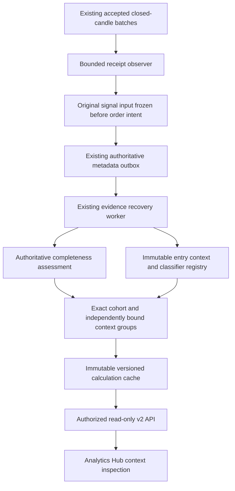

# NEXUS Strategy Intelligence — Sprint 2

## Scope and current decision

Sprint 2 extends the completed Sprint 1.5 evidence system with observational
entry context, deterministic sessions/regimes, exact-cohort context performance,
and an inspection tab in the existing Analytics Hub. It does not select or
promote strategies, authorize orders, or implement the Sprint 3 Edge Map.

No production access or deployment occurred. XRP's claimed 22 trades, 40.9%
win rate, PF 1.13 and +$0.84 remain **UNVERIFIED**. The missing authoritative
export/access requirements remain documented in
[XRP evidence access](XRP_ADAPTIVE_MTF_EVIDENCE_ACCESS.md). Synthetic test and
benchmark observations do not verify that result.

The primary references were the completed Sprint 0 audit, Sprint 1 report,
[Sprint 1.5 report](STRATEGY_INTELLIGENCE_SPRINT15.md), and actual repository
interfaces. The existing Adaptive strategy remains `adaptive_trend_pullback`
version `1.0.0`; its effective configuration fingerprint is unchanged by
intelligence classification.

## Architecture and causal evidence

The observer sees only batches already accepted by existing closure/staleness
policies. It never fetches additional bars or changes required/optional HTF
gates. Its in-memory registry is bounded to 32 series and 1,500 candles per
series. It preserves the first actual observation and latches price/provenance
conflicts. Eviction loses proof and produces UNKNOWN rather than a fabricated
receipt time.

`Bar.timestamp` is the candle open. Live causal cutoff is the actual aware
signal-observation time, separately retaining signal-candle open and decision
candle close. Historical replay uses its historical decision boundary and
cannot turn a current download time into original availability. Inputs include
only strategy history and the native HTF context already aligned by execution.
The original classifier definition travels with the raw input through approval,
deferred fill, primary metadata outbox, restart, and journal reconciliation.

Observation exceptions are isolated. Classification and aggregation run only
from `EvidenceRecoveryLoop`'s additive callback, after normal reconciliation.
They have no order interface and no financial write methods. The existing
recovery loop remains the worker framework; no second framework or ledger was
introduced. Logical effects are idempotent, with at-least-once recovery; no
exactly-once delivery claim is made.

Entry context exists for each observed actual entry, including scale-ins.
Partial-exit remainder rows are not entries. Statistical contextual performance
uses the episode's original root entry, preserving subsequent entry contexts
without allowing them to replace its session/regime or inflate trade count.
Original observed episode risk and constituent economic receipts remain the
Sprint 1 authority.

## Models and migration

New pure immutable models are `CandleObservation`, `ClassifierParameters` and
`SessionDefinition`. Snapshots and calculation reports are JSON projections;
financial values retain Decimal text rather than adding REAL columns.

`data/journal_context_migrations.py` adds three tables to the **existing SQLite
decision journal**:

| Table | Purpose |
|---|---|
| `regime_classifier_versions` | Permanently bind classifier ID/version to full parameters and hash |
| `market_context_snapshots` | Immutable actual-entry or explicitly versioned research classifications |
| `intelligence_calculation_runs` | Immutable, reproducible derived cache reports |

The migration adds identity/ownership/episode/time/dimension indexes, references
existing episode headers, and prohibits UPDATE/DELETE of committed metadata.
Snapshot IDs hash episode, entry trade, classifier identity and classification
kind. Writes validate the full immutable episode scope and an actual
opened/recovered entry event. Same-ID retries return the existing logical effect;
conflicting content raises an error. Definitions with changed parameters under
the same classifier version are rejected.

No new Supabase financial migration is needed in Sprint 2. The existing primary
outbox carries additive raw context in its current JSON envelope. Journal schema
upgrade is idempotent; interruption is recovered by reapplying it. Application
rollback retains these additive tables and runs the previous journal queries.
Never delete evidence or rewrite financial history as a rollback shortcut.
Tests exercise literal historical schema/rows, interruption and previous-query
compatibility. Production restore/schema/permissions have not been tested.

Snapshots retain trade/episode and exact strategy/configuration identity;
symbol, market and exchange; signal/entry/candle/publication clocks; entry/HTF
timeframes; session/trend/volatility/experimental structure; ATR, percentile,
trend strength; source; classifier ID/version/hash; original frozen inputs;
classification clock and quality/reconstruction reasons.

## Classifier formulas and version boundaries

The full mathematical contract is
[Market context classifier 1.0.0](MARKET_CONTEXT_CLASSIFIER_V1.md).

Sessions are half-open local intervals, seven days per week for crypto: Tokyo
09:00–17:00, London 08:00–17:00, New York 08:00–17:00. Configurable overnight
intervals are supported. Canonical precedence is London/New York overlap,
New York, London, Asia, then off-session; active-session tags never double count
statistical episodes. IANA timezones handle DST and seasonal overlap changes.
Their TZif hashes are effective classifier parameters. Frozen replay rejects a
changed timezone definition; restore the original rules or create an explicit
new research version, then restart after timezone upgrades.

Trend uses existing EMA/ATR and the existing pure ADX calculation: entry EMA20,
three-bar slope normalized by ATR14; directional price bias; ADX14 range/strong
thresholds 20/25; HTF EMA50 with one-bar slope confirmation. Strong slope
threshold is 0.05 ATR per bar. Weak ADX or near-zero slope is RANGE; unresolved
direction stays UNKNOWN. The formulas, equality boundaries and history
requirements are pinned in the versioned definition. This classifier does not
replace execution's `services/regime.py` gate.

Volatility uses current ATR/close versus the preceding 100 available historical
ATR/close observations, with midrank ties. Bands are LOW below 25, NORMAL below
75, HIGH through 95, and EXTREME above 95. Zero/nonfinite ATR, missing
publication proof, conflicts, gaps, staleness, missing HTF or insufficient
history cannot receive a valid trend/volatility classification. Retained history
is 115 entry and 51 HTF candles. Structure remains experimental UNKNOWN.

Point-in-time selection excludes future, forming and unpublished observations
before reading their price values. Availability must be proven at/before the
signal cutoff and at/after closure; Binance's inclusive close millisecond is
normalized. Input hashes exclude future candles and calculation time. Tests
change future entry and HTF prices, publication times and malformed future
values without altering the historical result.

## Historical reconstruction and recomputation

Original sufficient, contiguous, native observations with proven availability
can be `SAFE_TO_RECONSTRUCT`. Incomplete original evidence is
`PARTIALLY_RECONSTRUCTABLE`; absent original clocks/inputs remain UNKNOWN.
MarketDataV2 upserts overwrite receipt time and cannot prove historical
availability. No present-day indicators, current defaults or synthetic funding
are backfilled into historical evidence.

`StrategyIntelligenceService.recompute_research` requires an exact authorized
owner/account/instance/session scope, source classifier identity, and a different
explicit classifier version. It reuses original frozen observations, appends
`RESEARCH` snapshots, and preserves `ENTRY` facts and financial records. Repeated
calls resume bounded batches idempotently. Public GET requests never invoke it;
default performance excludes research reclassifications. The operation performs
no market downloads or accounting access.

## Metrics, confidence and costs

The complete contract is
[strategy_intelligence.v2 metrics](STRATEGY_INTELLIGENCE_METRICS_V2.md).
Existing v1 endpoints, financial formulas and existing dashboard metrics remain
unchanged. New context performance uses all strategy/version/fingerprint,
owner/account/instance/lab/session, execution-mode/source and optional asset
dimensions exactly. Counterfactuals, rejected/cancelled/expired decisions,
shadow outcomes and open episodes never contribute to completed performance.

Supported context groups include asset, session, trend, volatility, direction,
entry timeframe, asset × session/trend/volatility, asset × session × trend, and
timeframe × direction. Each group also partitions by classifier ID/version/hash
and captured fee/funding/slippage model identity. Root-entry membership, original
v1 episode digest, current source assessment, and entire context assignment
bind each subgroup's own evidence report. Missing or unknown membership blocks
verification; a subgroup cannot inherit favorable parent certification.

One final-closed episode is one statistical trade. Net/gross P&L, fees/funding,
PF, R, duration, drawdown and streaks reuse v1 Decimal arithmetic. Additional
planned RR, direction, MAE/MFE and separately measured slippage use only captured
facts; unknown values stay NULL with sample/coverage counts. Booked net is never
charged costs twice. Slippage embedded in an executed price does not prove a
separately measured slippage cost. Unknown or unnamed cost models block full
verification, even where booked amounts are known.

Current forward-paper funding remains **UNMODELED**, with funding amounts
unknown. Fee coverage can be complete while funding/slippage/model coverage
blocks profitability verification. Positive observed booked P&L is not verified
full-cost profitability or evidence of an edge.

Evidence completeness, context quality, cost coverage, descriptive performance,
and sample confidence are separate outputs. Confidence bands are 0–29
INSUFFICIENT; 30–74 EARLY_EVIDENCE; 75–149 DEVELOPING; 150–299 STRONG_SAMPLE;
300+ MATURE_SAMPLE. Each subgroup has its own count and Wilson 95% interval for
net-positive episode frequency, with dependence, overlapping/shared-signal,
small-sample and return-concentration warnings. These are not profitability
proof or strategy-promotion criteria.

## Incremental processing, freshness and API

Missing-entry discovery reads indexed identity metadata in one bounded query,
then classifies at most 500 new entries per worker pass. Aggregation caches
changed exact cohorts (including separate asset cohorts) and refreshes their
assessment after 240 seconds. Immutable runs are keyed by cohort/grouping and
source/context watermarks. Requests read cached reports and bounded context
pages; they never scan the financial history, reconcile, fetch prices or place
orders. Worker snapshots are bounded to 100,000 records; overflow or an
unreadable/changing source yields unknown/incomplete evidence.

Delivered fills immediately invalidate readiness using a short separate lock.
Generation checks and a final authoritative source fence after aggregation
prevent a concurrent fill or observer outage from publishing a READY cache.
Restart has no ready scopes until reconciliation; reports older than 300 seconds
are STALE. Every nested verification/history/readiness alias is cleared on those
reads. Numeric observations remain available with their original calculation
timestamp, but cannot claim current verified profitability.

The ten read-only routes use `/api/v2/strategy-intelligence`: cohorts, context,
sessions, regimes, volatility, performance, strategies, and per-strategy
breakdown/confidence/context-history. Existing authentication resolves owner,
instance, account and active/archived simulation session. Client owner/account
or completeness assertions, repeated/unknown query parameters and malformed
exact-cohort requests are rejected. Cache lookup applies ownership SQL filters
and checks its full cohort/scope/grouping binding; conflicts return no groups.
Responses use no-store and expose calculation time, independent qualities,
cost coverage and sample confidence. Existing multi-user restrictions remain.

## UI and existing regression repairs

`AnalyticsHub` adds only a Context Intelligence inspection tab, using existing
API polling and explicit cohort/group selection. It displays raw context,
performance and separate quality/confidence/cost/verification explanations.
Unknown amounts are unavailable, not zero. HTTP 200 error payloads, conflicts,
stale and restart-required reports are visibly unverified. No static XRP results
or Edge Map were introduced.

Expanded browser testing reproduced stale navigation contracts on unchanged
source. Tests now use current canonical navigation and retain legacy bookmark,
financial-control, risk, locked-live, password and kill-switch assertions.
Contract fixtures were completed rather than weakening assertions. One real
existing frontend regression was repaired: the linked Safety Center component
was absent from the application route switch. Its route is restored and both
stop-control requests remain tested. Browser-only external Binance transport is
isolated by the test fixture, preserving zero-console-error assertions.

## Files changed

Existing integration files: `data/journal_store.py`, `services/auto_engine.py`,
`services/strategy_evidence_capture.py`, `services/strategy_evidence_recovery.py`,
`services/trading_instances.py`, `webhook_api.py`, and `app.py`.

New backend files: `data/journal_context_migrations.py`,
`data/journal_context_store.py`, `services/market_context_observer.py`,
`services/market_context_classifier.py`, `services/strategy_intelligence_v2.py`,
`services/strategy_intelligence_service.py`, `routers/strategy_intelligence.py`,
and `scripts/benchmark_context_metrics.py`.

Frontend: `src/pages/ContextIntelligence.tsx`, `src/pages/AnalyticsHub.tsx`,
`src/App.tsx`; browser contracts in `e2e/mock.ts`, `e2e/clicks.spec.ts`,
`e2e/flows.spec.ts`, and new `e2e/strategy-intelligence.spec.ts`.

New tests: `test_journal_market_context.py`, `test_market_context_classifier.py`,
`test_market_context_observer.py`, `test_market_context_runtime.py`,
`test_strategy_intelligence_v2.py`, `test_strategy_intelligence_service.py`,
`test_strategy_intelligence_api.py`, and reusable synthetic
`context_intelligence_fixtures.py`. Documentation includes this report, the
classifier/v2 contracts, and benchmark artifacts.

## Validation and benchmarks

Before implementation, the unchanged Sprint 1.5 baseline passed **2,665 Hub
tests, 15 skipped**, including opt-in isolated Postgres/gateway outbox checks;
the root suite passed **508**. The focused final new-backend selection passed
**223 tests, zero failures**, including migrations, DST, strict publication,
future-price invariance, financial precision, partial exits, exact scope,
cache corruption, restart/outage recovery, and versioned research preservation.
Independent review found stale nested flags and an aggregation source-fence
gap; both were reproduced, corrected and tested before the final full rerun.
An earlier full run was interrupted for these corrections and is not counted
as a completed full-suite result.

Final local validation is complete: the Hub suite passed **2,888 tests with 15
skips**, the root suite passed **508 tests**, and the corrected browser suite
passed **131 tests**. TypeScript type checking and the Vite production build
also passed. The local authenticated browser smoke used an empty owner and a
synthetic populated owner; it had zero console errors, reconciled net P&L and
fees, and left the authoritative snapshot unchanged.

The Hub run included the opt-in isolated PostgreSQL/gateway outbox checks. These
are local disposable services, not a production connection.

Synthetic isolated development benchmarks (not production sizing guarantees):

| Operation | Measurement |
|---|---|
| Classify 1,000 entry + 250 HTF inputs, retain 115 + 51, 100 iterations | median 4.96 ms; p95 5.19 ms; JSON about 40.7 KB |
| Indexed cohort discovery, 1,000 stored contexts, 30 iterations | p50 1.17 ms; p95 1.43 ms |
| Metadata membership for 1,000 contexts | p50 2.71 ms; p95 3.97 ms |
| Read 100 context rows with synthetic raw payload | p50 18.38 ms; p95 24.88 ms |
| Pure metrics, 1,000 episodes / 60 groups, tracemalloc enabled | 0.7145 s; 6.25 MiB peak |
| Pure metrics, 10,000 episodes / 60 groups, tracemalloc enabled | 6.9384 s; 53.46 MiB peak |

Pure metrics benchmark reproduction from `automation-hub`:
`../.venv/bin/python scripts/benchmark_context_metrics.py --episodes 1000 10000 --tracemalloc`.
The [raw metrics artifact](STRATEGY_INTELLIGENCE_SPRINT2_METRICS_BENCHMARK.json)
checks exact episode/Decimal totals and reports zero financial ledger reads or
writes. These benchmarks use synthetic observations and cannot verify XRP.

## Compatibility, blockers and Sprint 3 prerequisites

Sprint 2 preserves strategy rules/parameters, risk limits, accounting writes,
paper-account isolation, fill eligibility/timing rules, live restrictions,
required-context fail-closed policies, and v1 formulas. The Sprint 1.5 baseline
source manifest is the comparison boundary because earlier sprints are still
uncommitted in the workspace. Final inspection must confirm all baseline
strategy/execution/financial-ledger/Supabase migration files unchanged by Sprint 2.

Deployment readiness is **review and authorized isolated staging validation**,
not production approval. Remaining prerequisites are production-shaped restored
schema/permissions/backup testing, representative volume/load and concurrent
worker validation, and an approved evidence/cache retention/archival policy.
Use the existing production validation test selection as the staging preflight:
`NEXUS_PG_OUTBOX_TEST=1 ../.venv/bin/python -m pytest -q
tests/test_evidence_production_validation.py tests/test_paper_evidence_outbox.py`.
Run it only against a disposable restored staging database and matching
configuration; the command does not select production by itself.
Immutable cache runs accumulate; no automatic deletion was introduced. Worker
assessment still materializes bounded journal/primary snapshots and recomputes
changed cohort groups; benchmark scale is not a guarantee for a 100,000-row
production cohort. Source REAL precision remains disclosed rather than repaired.

Funding/slippage provenance, unknown historical availability, absent observed
MAE/MFE, changed timezone-rule versions and unverified XRP evidence remain
explicit limitations. Analytics processing failures preserve execution and
yield pending/unknown/recovering reports rather than favorable certification.

Sprint 3 consumers must use exact identity/classifier/cost partitions and each
subgroup's own freshness, evidence, context and confidence gates. Before an Edge
Map or selection workflow, obtain authorized authoritative history; define
retention, market/timezone provenance and sample-dependence policies; validate
cost coverage and large-volume staging recovery; and define how UNKNOWN and
small-sample outcomes remain visible. Intelligence results do not grant order
or strategy-promotion authority.
